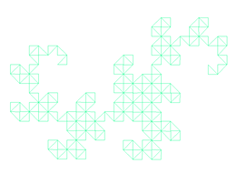

# Fractal-Generator
A C++ program to generate recursive polygonal fractals portably, with examples using the X11 framework. 

The program is written in C++14 and can be compiled appropriately with it.

A fractal generation framework is provided, with classes for Points, Polygons, Displayers, Transformers, and Drawers. The `XDisplayer` is provided as an implementation of the abstract `Displayer` class, and it plugs into the X11 framework to provide a display for the fractal. However, the generality of the `Displayer` class means the user can create their own implementation class to display their fractals on whatever operating system or using whatever framework they choose. 

To create a fractal, the user must specify a `Polygon` as an input and a `ShapeTransformer` functor which will take as an argument a "seed" `Polygon` and produce a `vector<Polygon>`. The `FractalDrawer` will then repeat this process, with the user being able to specify the number of times it is repeated (the fractal's `depth`), as well as at which depth the fractal drawing should begin. Many examples can be found in the `main.cpp` file.   

Here are some examples of images that I have created using the program throughout its development process. Not all of these would be considered "fractals," but they showcase what the framework is capable of beyond fractals:

Here is the Sierpinski Triangle:

Here is the Koch Snowflake (created using a generalization of the Sierpinski method, so the outline is the snowflake):

Here are some examples showing the buildup to Dragon curve, by taking the fractal at different depths and drawing at the final depth. 

Depths 1 through 3:

For brevity, we will now skip some depths along the way:

And finally, at a much higher depth:

